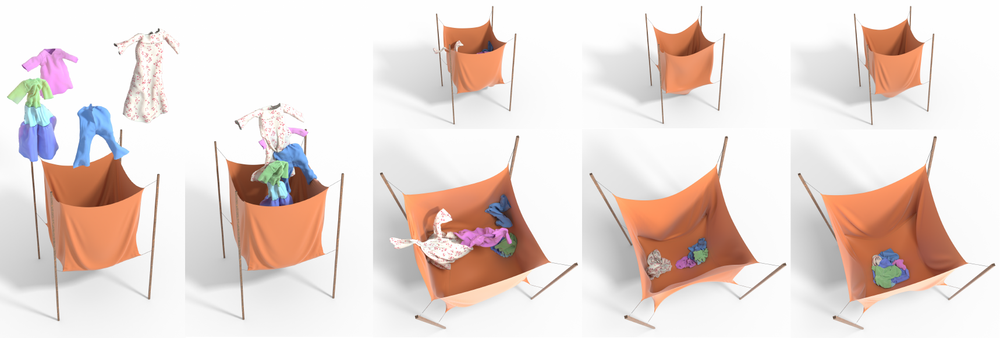

<h1 align="center">Efficient B-Spline Finite Elements for Cloth Simulation</h1>

<div align="center">
  <p>
    <a href="https://aressegetesstery.github.io/"><strong>Yuqi Meng</strong></a><sup>1,2</sup>,
    <a href="https://github.com/Yihao-Shi"><strong>Yihao Shi</strong></a><sup>1,3</sup>,
    <a href="https://kemenghuang.github.io/"><strong>Kemeng Huang</strong></a><sup>1,4</sup>,
    <a href="https://zixuanvickylu.github.io/"><strong>Zixuan Lu</strong></a><sup>2</sup>,
    <a href="https://person.zju.edu.cn/nguo"><strong>Ning Guo</strong></a><sup>3</sup>,
    <a href="https://www.ai.hku.hk/people/academic-staff/taku"><strong>Taku Komura</strong></a><sup>4</sup>,
    <a href="https://yangzzzy.github.io/"><strong>Yin Yang</strong></a><sup>2</sup>,
    <a href="https://www.cs.cmu.edu/~minchenl/"><strong>Minchen Li</strong></a><sup>1,5</sup>
  </p>
  <p>
    <sup>1</sup>Carnegie Mellon University &nbsp;&nbsp;
    <sup>2</sup>University of Utah &nbsp;&nbsp;
    <sup>3</sup>Zhejiang University &nbsp;&nbsp; <br/>
    <sup>4</sup>The University of Hong Kong &nbsp;&nbsp;
    <sup>5</sup>Genesis AI
  </p>
  <p><strong>ACM Transactions on Graphics (SIGGRAPH 2026)</strong></p>
  <p>
    <a href="https://simulation-intelligence.github.io/BS-Cloth/"></a>
    <a href="https://arxiv.org/abs/2506.18867"></a>
    <a href="https://github.com/Simulation-Intelligence/BS-Cloth"></a>
  </p>
</div>

<div align="center">
  
</div>

## Overview

We present an efficient B-spline finite element method (FEM) for cloth simulation. The pipeline combines B-spline-specific optimizations (reduced integration with split membrane/bending quadrature, accelerated Hessian assembly) with general numerical optimizations (a partial-factorization linear solver). This codebase is a standalone simulator that implements the B-spline FEM in the paper with IPC integration for contact handling.

## Citation

If you find this work useful in your research, please cite our paper:

> Yuqi Meng, Yihao Shi, Kemeng Huang, Zixuan Lu, Ning Guo, Taku Komura, Yin Yang, and Minchen Li. 2026. Efficient B-Spline Finite Elements for Cloth Simulation. *ACM Trans. Graph.* 45, 4, Article 102 (July 2026). https://doi.org/10.1145/3811278

```bibtex
@article{meng2026bspline,
    author    = {Meng, Yuqi and Shi, Yihao and Huang, Kemeng and Lu, Zixuan and Guo, Ning and Komura, Taku and Yang, Yin and Li, Minchen},
    title     = {Efficient B-Spline Finite Elements for Cloth Simulation},
    year      = {2026},
    issue_date = {July 2026},
    publisher = {Association for Computing Machinery},
    address   = {New York, NY, USA},
    volume    = {45},
    number    = {4},
    issn      = {0730-0301},
    url       = {https://doi.org/10.1145/3811278},
    doi       = {10.1145/3811278},
    journal   = {ACM Trans. Graph.},
    month     = jul,
    articleno = {102}
}
```

## Repository Structure

```
BS-Cloth/
├── B-Spline-IPC/                # the simulator
│   ├── src/                       # core C++ sources
│   │   ├── Core/, Geometry/         # fundamentals + B-spline / linear primitives
│   │   ├── Energy/                  # membrane, bending, inertia, seam penalty
│   │   ├── Solver/                  # Newton/IP solver, surface manager, config
│   │   └── Utility/                 # CHOLMOD, OBJ exporter, YAML loader, math
│   ├── ext/                       # vendored third-party libs
│   │                                (Eigen, spdlog, fkyaml, stb, oneapi, IPC, ...)
│   ├── lib/, dll/                 # prebuilt Windows libs / runtime DLLs
│   ├── shaders/                   # GLSL shaders for the preview renderer
│   ├── models/                    # cloth / garment / animation assets
│   ├── seam/                      # seam definition files
│   ├── sample-configs/            # complex testcases presented in the paper
│   ├── config.yaml                # active experiment config read at runtime
│   └── B-Spline-IPC.vcxproj       # generated by premake
├── Altrar/                      # in-tree Vulkan preview renderer
├── Prebuild/                    # GenerateProject.bat / .sh
├── Execute/                     # RunCurrentBuild.bat / .sh
├── webpage/                     # project website
└── premake5.lua                 # workspace build script
```

Test assets live under `B-Spline-IPC/models/` and `B-Spline-IPC/seam/`. Configs for the stress tests in the paper can be found in `B-Spline-IPC/sample-configs/` references files. Details of configuration rules are elaborated in [`yaml-config-doc.md`](yaml-config-doc.md).

## Dependencies

Most third-party libraries are vendored under `B-Spline-IPC/ext/` (Eigen, spdlog, fkyaml, stb, oneAPI headers, IPC sources, …); on Windows, prebuilt binaries for SuiteSparse, LAPACK/OpenBLAS, and TBB are also shipped under `B-Spline-IPC/lib/` with their runtime DLLs in `B-Spline-IPC/dll/`. The remaining dependencies must be installed by the user.

- **C++20 toolchain** — Visual Studio 2022 (Windows), or GCC ≥ 11 / Clang ≥ 14 (Linux).
- **[premake5](https://premake.github.io/)** (≥ 5.0.0-beta8) — generates the project / makefiles. Available pre-built from the official website.
- **Intel oneAPI Base Toolkit** — provides MKL (used as the Pardiso direct solver and as Eigen's BLAS/LAPACK backend) together with the Intel OpenMP runtime. The build script reads two environment variables to locate them:
  - `MKLROOT` — root of the MKL install (e.g. `C:/Program Files (x86)/Intel/oneAPI/mkl/latest` on Windows).
  - `CMPLR_ROOT` — root of the Intel compiler install (e.g. `C:/Program Files (x86)/Intel/oneAPI/compiler/latest`).

  Pass `--no-mkl` to `premake5` to fall back to Eigen's native solver and skip MKL altogether (the env vars are then not required, at the cost of solver performance).
- **[Vulkan SDK](https://vulkan.lunarg.com/)** — required by the in-tree preview renderer, which is enabled by default on Windows. Not needed if you build with `BSIPC_DISABLE_RENDERER` defined.
- **Intel oneAPI TBB** — set `TBBROOT` to its install root so premake can find the TBB libraries.
- **SuiteSparse** (CHOLMOD, AMD, CAMD, COLAMD, CCOLAMD, suitesparseconfig) — install via your package manager, e.g. `sudo apt install libsuitesparse-dev`. If high performance is desired, consider building from scratch and linking Intel MKL.

## Installation

This project adopts [premake](https://premake.github.io/) as its build system, since its portability best suites the scale of the codebase.

### Windows

To run the basic functionalities of this codebase on Windows, you need to have Visual Studio (preferably 2022) installed. Run `Prebuild/GenerateProject.bat` will generate the `.sln` Visual Studio solution files for you.

### Linux

[Premake](https://premake.github.io/) does not have its latest version available on various package managers, so installing from its official website is required. Run the following command to install:

```bash
wget https://github.com/premake/premake-core/releases/download/v5.0.0-beta8/premake-5.0.0-beta8-linux.tar.gz

# the following should yield a premake5 executable in the same directory
tar -xvf premake-5.0.0-beta8-linux.tar.gz

# This should give something like "premake5 (Premake Build Script Generator) 5.0.0-beta8"
premake5 --version
```

Consider moving it to your binary directory (something similar to `/usr/bin`) for future usage.

To generate the makefiles, run `Prebuild/GenerateProject.sh`. Alternatively, go to the root directory of the project and run
```
premake5 gmake2
```
Add the flag `--cc=clang` if you are using `clang` family compilers. Check more customization on the official documentation.

## Modules

There are various macros in the project, which gives fine control over toggling on/off of different functionalities.

### `BSIPC_DISABLE_RENDERER`

Definition of `BSIPC_DISABLE_RENDERER` suppresses real-time rendering of the resulting garment along with the simulation. The renderer is rather simple and only serves as a preview of the result.

If this macro is disabled, the program requires installation of [Vulkan Toolkit](https://vulkan.lunarg.com/) for rendering, as the simple renderer relies on Vulkan. `BSIPC_DISABLE_RENDERER` is on default disabled on Windows, and enabled on Linux.

### `BSIPC_YAML2OBJ`

The simulator records all the intermediate results of simulation using `.yaml` files in `steps/` folder at the same location as the executable. Enabling `BSIPC_YAML2OBJ` will disable all the simulation, and instead creates a series of `.obj` file in the `objs/` folder. This can then be used for visualization and rendering with professional renderer, for example *Cycles* in *Blender*. Importing can be done using [Blender Sequence Loader](https://github.com/InteractiveComputerGraphics/blender-sequence-loader).

## Configuring Experiments

The simulator reads configuration of experiments from `config.yaml` in the same position as the executable. It creates a `log.txt` logging concise information of the current status, and a `steps/` folder creating a series of `.yaml` files saving the configuration of primitive at each step of simulation. If `screenshot` field is set to `true` in `config.yaml` and `BSIPC_DISABLE_RENDERER` is disabled, there will be an additional `cache/` folder saving the rendering result at each step.

For simplicity of parameter setting, when quadrature scheme falls under the class of local quadrature, the per-patch quadrature order is hardcoded to be 2 for simplicity.

The codebase further enables resuming simulation from a given step, as long as the corresponding configuration is provided. To resume a simulation, copy the yaml file at that step, rename it to `config.yaml`, and ensure that `continue_on_step` field is set to be `true` (this will automatically be the case if you are using the yaml file generated by the codebase). Running the executable now will start simulation continuing on the designated step.
